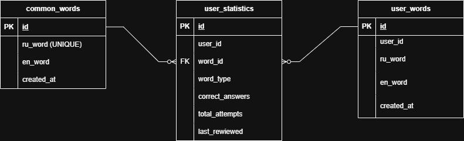

# **Курсовая работа «ТГ-чат-бот «Обучалка английскому языку»» по курсу «Базы данных»**

## Группа PY-140

## 📋 ОПИСАНИЕ
EnglishCard Bot - это Telegram-бот для изучения английских слов. 
В боте уже есть 10 общих слов (цвета и местоимения), а также можно 
добавлять свои слова. Все слова сохраняются в базе данных и доступны 
только вам.

---

## 🚀 НАЧАЛО РАБОТЫ
1. Найдите бота в Telegram: **@EnglishCards PY-140**
2. Отправьте команду **/start**
3. Вы увидите приветствие и кнопки внизу экрана

---

## 🎮 КАК УЧИТЬ СЛОВА
1. Нажмите кнопку **"Дальше 🚀"**
2. Бот покажет слово на русском и 4 варианта перевода
3. Нажмите на правильный вариант

**Реакция бота:**
- ✅ Правильно: `Отлично!❤️ red -> красный`
- ❌ Неправильно: покажет правильный ответ и кнопку `🔄 Попробовать снова`

---

## ➕ КАК ДОБАВИТЬ СЛОВО
1. Нажмите **"Добавить слово ✨"**
2. Отправьте слово в формате: `русское - английское`
3. Пример: `книга - book`
4. Бот подтвердит: `✅ Слово успешно добавлено!`

---

## 🗑 КАК УДАЛИТЬ СЛОВО
1. Нажмите **"Удалить слово"**
2. Бот покажет список ваших слов
3. Отправьте слово на русском
4. Бот подтвердит: `✅ Слово 'книга' удалено`

**Важно:** Можно удалять только свои слова. Общие слова удалить нельзя.

---

## 📋 СПИСОК ОБЩИХ СЛОВ (10 штук)
- красный - red
- синий - blue
- зеленый - green
- желтый - yellow
- я - I
- ты - you
- он - he
- она - she
- мы - we
- они - they

---

## 📱 ВСЕ КОМАНДЫ
- `/start` - начать работу
- `/cancel` - отменить действие

---

## ⚠️ ВОЗМОЖНЫЕ ОШИБКИ
- ❌ "Неверный формат" - используйте `слово - перевод`
- ❌ "Это слово уже есть" - нельзя добавить два одинаковых слова
- ❌ "Слово не найдено" - проверьте правильность написания
- ❌ "Используйте кнопки снизу" - нажимайте на кнопки, а не вводите текст

---

## 🗄 СТРУКТУРА БАЗЫ ДАННЫХ

### Таблицы:
1. **common_words** - общие слова для всех пользователей
2. **user_words** - персональные слова пользователей
3. **user_statistics** - статистика изучения

### Схема БД

### SQL скрипты:
- [create_db.sql](database/create_db.sql) - создание таблиц
- [init_data.sql](database/init_data.sql) - заполнение 10 общими словами